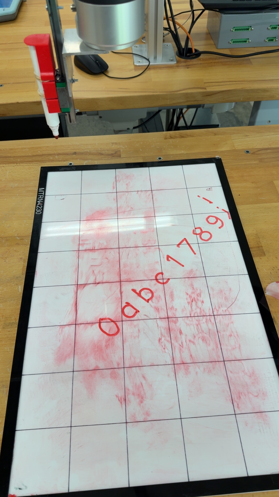
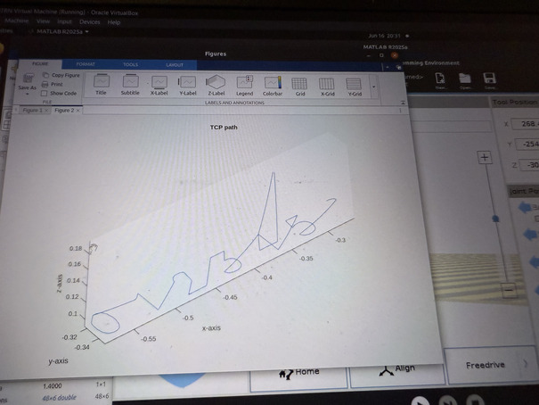

# UR5e Writing Bot

MATLAB utilities for generating handwriting-style trajectories for a **UR5e** robot.  
Given a text string or a simple math expression, the scripts create a dense end-effector path and stream it to the robot via RTDE, so the UR5e can “write” on a planar surface.



---

## Features

- Uses a **Hershey font** to convert ASCII characters into 2D strokes.
- Supports:
  - Free text (up to 10 alphanumeric characters).
  - Simple math expressions of the form `a+b=`, `a-b=`, `a*b=`, rendered in a
    column-style layout (operands and result right-aligned, operator in its own column, i.e. long division style).
- Interpolates strokes to generate smooth trajectories with configurable waypoint density.
- Adds pen-up / pen-down behaviour using configurable `zWrite` and `zLift` heights.
- Applies 2D transformations (x/y translation and yaw rotation) to position the writing on the workspace.
- Streams the resulting Cartesian waypoints to a UR5e over RTDE and plots the executed path.



---

## Repository Structure

- `finalWriter.m`  
  Main entry script. Handles:
  - User input (text or math expression).
  - Trajectory generation for text or math grid.
  - Application of x/y/yaw offsets.
  - Construction of RTDE waypoint path and execution on the UR5e.

- `characters.m`  
  Earlier standalone script showing basic ASCII trajectory generation and execution.

- `allFuncs.m`  
  Helper script demonstrating RTDE connection setup, simple moves and path plotting.


---

## Prerequisites

- **MATLAB**
- A **UR5e** robot or URSim instance reachable over the network.
- An RTDE MATLAB client (e.g. `rtde.m` class) available on the MATLAB path.
- Robotics Vision Toolbox / RVC startup script (`startup_rvc`) on the path.

Update the IP address in the scripts (`host = '192.168.0.100';` etc.) to match your own robot / simulator setup.

---

## Quick Start

1. Clone the repository:
```bash
git clone https://github.com/darshan-k-s/UR5e_WritingTasks.git
cd UR5e_WritingTasks
```